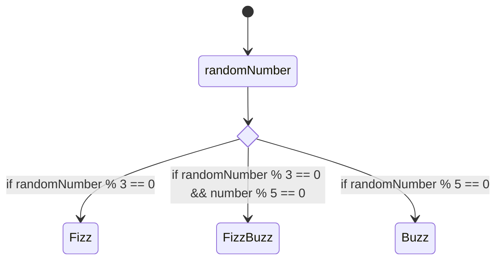

# FIZZ BUZZ

## consegna

- creare una console app con le seguenti funzioni:
    - la console genera una successione di numeri (da 1 a 100)
    - quando un numero è divisibile per 3 la console scrive "Fizz"
    - quando un numero è divisibile per 5 la console scrive "Buzz"
    - quando un numero è divisibile sia per 3 sia per 5 la console scrive "FizzBuzz"
    - quando nessuna delle condizioni precedenti è soddisfatta viene stampato solo il numero

Statement utilizzati

    Random random = new Random();
    int number = random.Next(1,101);

    (number % 3 == 0 && number % 5 == 0)

    while concatenato con if, else if, else e con la progressione del numero

Note

    - se due condizioni devono essere soddisfatte contemporaneamente vanno scritte prima delle medesime condizioni prese a se stanti

