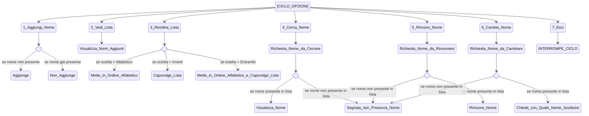

# ELENCO COMPAGNI DI CORSI CON SORTEGGIO
## VERSIONE 1

Creare una console app che contiene un elenco di nomi dei partecipanti del corso

L'app sorteggia un nome e lo visializza 

<details>

<summary>Statement utilizzati</summary>

    string[] names = new string[8];

    Random random = new Random();
    int drawn = random.Next(names.Length);

</details>

<details>

<summary>Codice</summary>

```C#
            // Creation of the classmates list

string[] names = new string[8];
        names[0] = "Allison";
        names[1] = "Sharon";
        names[2] = "Ginevra";
        names[3] = "Daniele";
        names[4] = "Serghej";
        names[5] = "Mattia";
        names[6] = "Matteo";
        names[7] = "Silvano";

            // The console generates a number corresponding to one of the classmates

Random random = new Random();
int drawn = random.Next(names.Length);

            // The console writes the name of the drawn classmate

Console.WriteLine($"The drawn classmate is {names[drawn]}");
```
</details>

## VERSIONE 2

Creare una console app che contiene un elenco di nomi dei partecipanti del corso

L'app sorteggia un nome e lo visualizza

L'app toglie dalla lista il nome sorteggiato

La app visualizza la lista dei nomi rimanenti

<details>

<summary>Statement utilizzati</summary>

    List<string> names = new List<string>

    int drawn = random.Next(names.Count);

    names.RemoveAt(drawn);

</details>

<details>

<summary>Codice</summary>

```C#
// RemoveAt(drawn) allows you to remove a classmate once they get picked up

List<string> names = new List<string> {"Allison", "Sharon", "Ginevra", "Daniele", "Serghej", "Mattia", "Matteo","Silvano"};

Random random = new Random();
int drawn = random.Next(names.Count);

Console.WriteLine($"Hello {names[drawn]}");

names.RemoveAt(drawn);

Console.WriteLine("Those who remain are:");

foreach (string name in names)
        {
            Console.WriteLine (name);
        }
```
</details>

## VERSIONE 3


Creare una console app che contiene un elenco di nomi dei partecipanti del corso

L'app sorteggia un nome e lo visualizza

L'app toglie dalla lista il nome sorteggiato

La app visualizza la lista dei nomi rimanenti

L'app continua a sorteggiare finchè ci sono nomi nella lista

<details>

<summary>Statement utilizzati</summary>

    List<string> names = new List<string>

    Random random = new Random();

    while(names.Count > 0)

    names.RemoveAt(drawn);

    foreach (string name in names)

</details>

<details>

<summary>Codice</summary>

```C#
            // List of classmates

List<string> names = new List<string> {"Allison", "Sharon", "Ginevra", "Daniele", "Serghej", "Mattia", "Matteo","Silvano"};

            // The console generates a number corresponding to one of the classmates

Random random = new Random();

while(names.Count > 0)
{
    int drawn = random.Next(names.Count);

    Console.WriteLine($"Hello {names[drawn]}");

                // Remove drawn name from the list

    names.RemoveAt(drawn);

                // The app shows the remaining classmates

    Console.WriteLine("Those who remain are:");

    foreach (string name in names)
            {
                Console.WriteLine (name);
            }
}
```
</details>

## VERSIONE 4

Creare una console app che contiene un elenco di nomi dei partecipanti del corso

L'app sorteggia un nome e lo visualizza

L'app toglie dalla lista il nome sorteggiato

L'app sposta il nome sorteggiato in una seconda lista

L'app visualizza la lista dei nomi rimanenti e dei già sorteggiati

L'app continua a sorteggiare finchè ci sono nomi nella lista

<details>

<summary>Statement utilizzati</summary>

    List<string> names = new List<string> 

    List<string> drawns = new List<string> ();

    Random random = new Random();

    while(names.Count > 0)

    int index = random.Next(names.Count);

    string drawn = names[index];

    names.RemoveAt(index);

    drawns.Add(drawn);

    foreach (string name in names)

    foreach (string name in drawns)

    Thread.Sleep(1000);

</details>

<details>

<summary>Codice</summary>

```C#
            // List of classmates

List<string> names = new List<string> {"Allison", "Sharon", "Ginevra", "Daniele", "Serghej", "Mattia", "Matteo","Silvano"};

List<string> drawns = new List<string> ();

            // The console generates a number corresponding to one of the classmates

Random random = new Random();

while(names.Count > 0)
{
    int index = random.Next(names.Count);
    string drawn = names[index];

    Console.WriteLine($"Hello {drawn}");

            // Remove drawn name from the list and add drawn name to drawns list

    names.RemoveAt(index);
    drawns.Add(drawn);

            // The app shows the remaining classmates

    Console.WriteLine("Those who remain are:");

    foreach (string name in names)
            {
                Console.WriteLine (name);
            }

           // The app shows the drawn classmates

    Console.WriteLine("Those who have been already drawn are:");

    foreach (string name in drawns)
            {
                Console.WriteLine (name);
            }
}
Thread.Sleep(1000);
```
</details>

## VERSIONE 5

Creare una console app che contiene un elenco di nomi dei partecipanti del corso

L'app permette di inserire un nuovo partecipante

L'app visializza la lista dei partecipanti

L'app permette di uscire

<details>

<summary>Statement utilizzati</summary>

    List<string> addedNames = new List<string> ();

    string name;

    int choice;

    choice = int.Parse(Console.ReadLine()!);

    switch (choice) 

    while (choice != 3);

</details>

<details>

<summary>Codice</summary>

```C#
            // Creation of an empty list, value "name" and "choice"

List<string> addedNames = new List<string> ();
string name;
int choice;

            // The app lets us picking up options until we choose to exit

do
{
    Console.WriteLine("Choose an option between the following:");

    Console.WriteLine("1. Add name");
    Console.WriteLine("2. See added names");
    Console.WriteLine("3. Exit");

    choice = int.Parse(Console.ReadLine()!);

    switch (choice) 
    {
        case 1:
            Console.Write("Insert here the name you want to add");
            name = Console.ReadLine();

            addedNames.Add(name);
            break;                                         
        case 2:
            Console.WriteLine("The current participants are:{addedNames.Count}\n The complete list is:");

            foreach (string added in addedNames)
            {
            Console.WriteLine(added);
            }
            break;
        case 3:
                
            Console.WriteLine("This session will be closed :)");
            break;
        default:
        Console.WriteLine("The current option is not valid");
        break;
    }
}
while (choice != 3);
```
</details>

## VERSIONE 6

Creare una console app che contiene un elenco di nomi dei partecipanti del corso

L'app permette di inserire un nuovo partecipante

L'app visializza la lista dei partecipanti

L'app permette di ordinare la lista dei partecipanti in ordine alfabetico

L'app permette di uscire

- partecipanti.Sort();       ordinamento della lista in ordine alfabetico 

- partecipanti.Reverse();    capovolgimento della lista

<details>

<summary>Statement utilizzati</summary>

    List<string> addedNames = new List<string> ();

    string name;

    int choice;

    string rearrange;

    choice = int.Parse(Console.ReadLine()!);

    switch (choice) 

    addedNames.Sort();

    addedNames.Reverse();

    while (choice != 4);

</details>

<details>

<summary>Codice</summary>

```C#
            // Creation of an empty list, value "name" and "choice"

List<string> addedNames = new List<string> ();
string name;
int choice;
string rearrange;

            // The app lets us picking up options until we choose to exit

do
{           
    Console.WriteLine("Choose an option between the following:");

    Console.WriteLine("1. Add name");
    Console.WriteLine("2. See added names");
    Console.WriteLine("3. Rearrange your list");
    Console.WriteLine("4. Exit");

    choice = int.Parse(Console.ReadLine()!);

    switch (choice) 
    {
        case 1:         // To add a name to our list
            Console.Write("Insert here the name you want to add\t");
            name = Console.ReadLine()!.Trim();

            addedNames.Add(name);
            break;                                         
        case 2:         // To see our list
            Console.WriteLine("The current participants are:{addedNames.Count}\n The complete list is:");

            foreach (string added in addedNames)
            {
            Console.WriteLine(added);
            }
            break;
        case 3:         // To rearrange our list
            Console.WriteLine("Do you prefer rearrange the list in alphabetical or reversed order, or both (A/R/B) ?");

            rearrange = Console.ReadLine()!.ToUpper().Trim();

            if (rearrange == "A" )
            {
                addedNames.Sort();
            }
            else if (rearrange == "R")
            {
                addedNames.Reverse();
            }
            else if (rearrange == "B")
            {
                addedNames.Sort();
                addedNames.Reverse();
            }
            else
            {
                Console.WriteLine("The current option is not valid");
            }
            break;
        case 4:         // To stop the cicle
            Console.WriteLine("This session will be closed :)");
            break;
        default:
        Console.WriteLine("The current option is not valid");
        break;
    }
}
while (choice != 4);
```
</details>

## VERSIONE 7

Creare una console app che contiene un elenco di nomi dei partecipanti del corso

L'app permette di inserire un nuovo partecipante

L'app visializza la lista dei partecipanti

L'app permette di ordinare la lista dei partecipanti in ordine alfabetico

L'app cerca un partecipante specifico

L'app permette di uscire

- partecipanti.Contains(nome)           si usa con if

<details>

<summary>Statement utilizzati</summary>

    List<string> addedNames = new List<string> ();

    string name;

    int choice;

    string rearrange;

    string search;

    switch (choice) 

    rearrange = Console.ReadLine()!.ToUpper().Trim();

    addedNames.Sort();

    addedNames.Reverse();

    while (choice != 5);

</details>

<details>

<summary>Codice</summary>

```C#
// Creation of an empty list, value "name" and "choice"

List<string> addedNames = new List<string> ();
string name;
int choice;
string rearrange;
string search;

            // The app lets us picking up options until we choose to exit

do
{           
    Console.WriteLine("Choose an option between the following:");

    Console.WriteLine("1. Add name");
    Console.WriteLine("2. See added names");
    Console.WriteLine("3. Rearrange your list");
    Console.WriteLine("4. Search a name of your choice inside the list");
    Console.WriteLine("5. Exit");

    choice = int.Parse(Console.ReadLine()!);

    switch (choice) 
    {
        case 1:         // To add a name to our list
            Console.Write("Insert here the name you want to add\t");
            name = Console.ReadLine()!.Trim();

            addedNames.Add(name);
            break;                                         
        case 2:         // To see our list
            Console.WriteLine("The current participants are:{addedNames.Count}\n The complete list is:");

            foreach (string added in addedNames)
            {
            Console.WriteLine(added);
            }
            break;
        case 3:         // To rearrange our list
            Console.WriteLine("Do you prefer rearrange the list in alphabetical or reversed order, or both (A/R/B) ?");

            rearrange = Console.ReadLine()!.ToUpper().Trim();

            if (rearrange == "A" )
            {
                addedNames.Sort();
            }
            else if (rearrange == "R")
            {
                addedNames.Reverse();
            }
            else if (rearrange == "B")
            {
                addedNames.Sort();
                addedNames.Reverse();
            }
            else
            {
                Console.WriteLine("The current option is not valid");
            }
            break;
        case 4:
            Console.WriteLine("What name do you want to search?");

            search = Console.ReadLine()!;
            if (addedNames.Contains(search))
            {
                Console.WriteLine($"{search} is in the list");
            }
            else
            {
                Console.WriteLine($"{search} is not in the list");
            }
            break;
        case 5:         // To stop the cicle
            Console.WriteLine("This session will be closed :)");
            break;
        default:
        Console.WriteLine("The current option is not valid");
        break;
    }
}
while (choice != 5);
```
</details>

## VERSIONE 8


Creare una console app che contiene un elenco di nomi dei partecipanti del corso

L'app permette di inserire un nuovo partecipante

Se il partecipante è già stato inserito l'app ci avvisa e non lo inserisce

L'app visializza la lista dei partecipanti

L'app permette di ordinare la lista dei partecipanti in ordine alfabetico

L'app cerca un partecipante specifico

L'app permette di uscire

- partecipanti.Contains(nome)           si usa con if

<details>

<summary>Statement utilizzati</summary>

    List<string> addedNames = new List<string> ();

    string name;

    int choice;

    string rearrange;

    string search;

    switch (choice) 

    if(addedNames.Contains(name))

    search = Console.ReadLine()!;

    if (addedNames.Contains(search))

    while (choice != 5);

</details>

<details>

<summary>Codice</summary>

```C#
// Creation of an empty list, value "name" and "choice"

List<string> addedNames = new List<string> ();
string name;
int choice;
string rearrange;
string search;

            // The app lets us picking up options until we choose to exit

do
{           
    Console.WriteLine("Choose an option between the following:");

    Console.WriteLine("1. Add name");
    Console.WriteLine("2. See added names");
    Console.WriteLine("3. Rearrange your list");
    Console.WriteLine("4. Search a name of your choice inside the list");
    Console.WriteLine("5. Exit");

    choice = int.Parse(Console.ReadLine()!);

    switch (choice) 
    {
        case 1:         // To add a name to our list
            Console.Write("Insert here the name you want to add\t");
            name = Console.ReadLine()!.Trim();

            if(addedNames.Contains(name))
            {
                Console.WriteLine($"Impossibility to add : {name} is already in the list!!");
            }
            else
            {
                addedNames.Add(name);
            }
            break;                                         
        case 2:         // To see our list
            Console.WriteLine("The current participants are:{addedNames.Count}\n The complete list is:");

            foreach (string added in addedNames)
            {
            Console.WriteLine(added);
            }
            break;
        case 3:         // To rearrange our list
            Console.WriteLine("Do you prefer rearrange the list in alphabetical or reversed order, or both (A/R/B) ?");

            rearrange = Console.ReadLine()!.Trim();

            if (rearrange == "A" )
            {
                addedNames.Sort();
            }
            else if (rearrange == "R")
            {
                addedNames.Reverse();
            }
            else if (rearrange == "B")
            {
                addedNames.Sort();
                addedNames.Reverse();
            }
            else
            {
                Console.WriteLine("The current option is not valid");
            }
            break;
        case 4:
            Console.WriteLine("What name do you want to search?");

            search = Console.ReadLine()!;
            if (addedNames.Contains(search))
            {
                Console.WriteLine($"{search} is in the list");
            }
            else
            {
                Console.WriteLine($"{search} is not in the list");
            }
            break;
        case 5:         // To stop the cicle
            Console.WriteLine("This session will be closed :)");
            break;
        default:
        Console.WriteLine("The current option is not valid");
        break;
    }
}
while (choice != 5);
```
</details>

## VERSIONE 9

Creare una console app che contiene un elenco di nomi dei partecipanti del corso

L'app permette di inserire un nuovo partecipante

Se il partecipante è già stato inserito l'app ci avvisa e non lo inserisce

L'app visializza la lista dei partecipanti

L'app permette di ordinare la lista dei partecipanti in ordine alfabetico

L'app permette di cercare un partecipante specifico

L'app permette di eliminare un partecipante dalla lista se quest'ultimo è presente

L'app permette di uscire

- partecipanti.Remove(nome);

<details>

<summary>Statement utilizzati</summary>

    List<string> addedNames = new List<string> ();

    string name;

    int choice;

    string rearrange;

    string search;

    switch (choice)

    if(addedNames.Contains(name))

    addedNames.Remove(name);

    while (choice != 6);

</details>

<details>

<summary>Codice</summary>

```C#
// Creation of an empty list, value "name" and "choice"

List<string> addedNames = new List<string> ();
string name;
int choice;
string rearrange;
string search;

            // The app lets us picking up options until we choose to exit

do
{           
    Console.WriteLine("Choose an option between the following:");

    Console.WriteLine("1. Add name");
    Console.WriteLine("2. See added names");
    Console.WriteLine("3. Rearrange your list");
    Console.WriteLine("4. Search a name of your choice inside the list");
    Console.WriteLine("5. Remove name");
    Console.WriteLine("6. Exit");

    choice = int.Parse(Console.ReadLine()!);

    switch (choice) 
    {
        case 1:         // To add a name to our list
            Console.Write("Insert here the name you want to add\t");
            name = Console.ReadLine()!.Trim();

            if(addedNames.Contains(name))
            {
                Console.WriteLine($"Impossibility to add : {name} is already in the list!!");
            }
            else
            {
                addedNames.Add(name);
            }
            break;                                         
        case 2:         // To see our list
            Console.WriteLine("The current participants are:{addedNames.Count}\n The complete list is:");

            foreach (string added in addedNames)
            {
            Console.WriteLine(added);
            }
            break;
        case 3:         // To rearrange our list
            Console.WriteLine("Do you prefer rearrange the list in alphabetical or reversed order, or both (A/R/B) ?");

            rearrange = Console.ReadLine()!.Trim();

            if (rearrange == "A" )
            {
                addedNames.Sort();
            }
            else if (rearrange == "R")
            {
                addedNames.Reverse();
            }
            else if (rearrange == "B")
            {
                addedNames.Sort();
                addedNames.Reverse();
            }
            else
            {
                Console.WriteLine("The current option is not valid");
            }
            break;
        case 4:
            Console.WriteLine("What name do you want to search?");

            search = Console.ReadLine()!;
            if (addedNames.Contains(search))
            {
                Console.WriteLine($"{search} is in the list");
            }
            else
            {
                Console.WriteLine($"{search} is not in the list");
            }
            break;
        case 5:
            Console.WriteLine("What name do you want to remove?");
            
            name = Console.ReadLine()!.Trim();

            if(addedNames.Contains(name))
            {
                addedNames.Remove(name);
                Console.WriteLine($"{name}'s name has been succesfully removed!");
            }
            else
            {
                Console.WriteLine($"{name}'s name doesn't appear in this list, therefore it can't be removed");
            }
            break;
        case 6:         // To stop the cicle
            Console.WriteLine("This session will be closed :)");
            break;
        default:
        Console.WriteLine("The current option is not valid");
        break;
    }
}
while (choice != 6);
```
</details>

## VERSIONE 10 DEFINITIVA

Creare una console app che contiene un elenco di nomi dei partecipanti del corso

L'app permette di inserire un nuovo partecipante

Se il partecipante è già stato inserito l'app ci avvisa e non lo inserisce

L'app visializza la lista dei partecipanti

L'app permette di ordinare la lista dei partecipanti in ordine alfabetico

L'app permette di cercare un partecipante specifico

L'app permette di eliminare un partecipante dalla lista se quest'ultimo è presente

L'app permette di sovrascrivere un nome precedentemente inserito

L'app permette di uscire

int indice = partecipanti.IndexOf(nome);            IndexOf restituisce l'indice del nome nella lista

<details>

<summary>Statement utilizzati</summary>

    List<string> addedNames = new List<string> ();

    string name;

    int choice;

    string rearrange;

    string search;

    switch (choice)

    if (addedNames.Contains(name))

    string newName = Console.ReadLine()!;

    int index = addedNames.IndexOf(name);

    addedNames[index] = newName;

    while (choice != 7);

</details>

<details>

<summary>Schema versione definitiva </summary>


    </details>