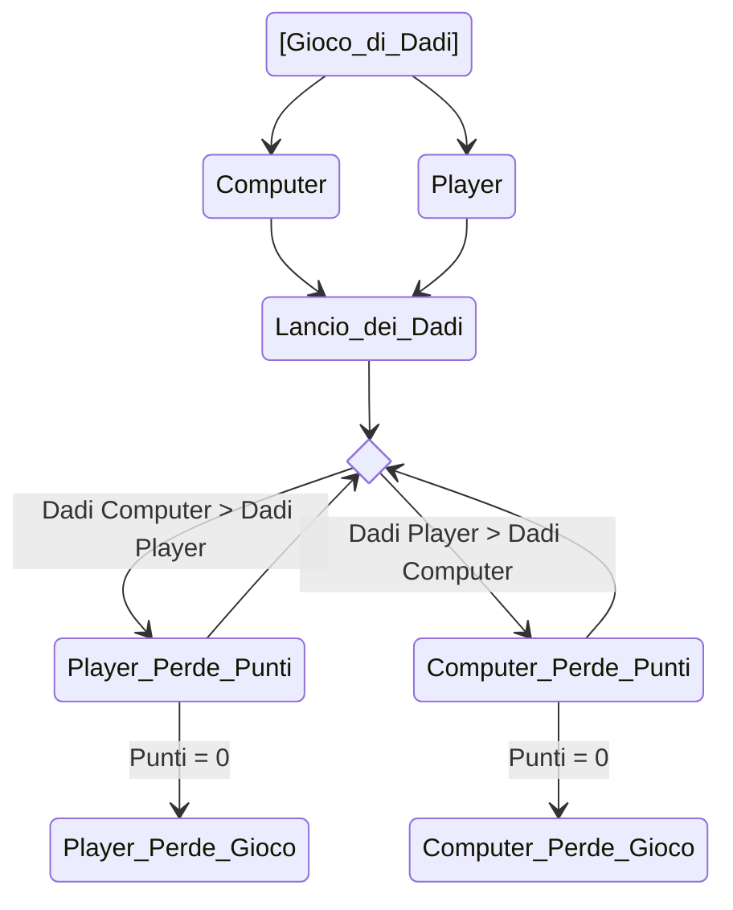

## ASSIGNMENT

Creare una console app per simulare un gioco di dadi

- Sia il giocatore sia il computer lanciano due dadi a ogni turno

- Chi ottiene la somma più alta vince

- Ogni giocatore ha 100 punti in partenza

- Al perdente vengono sottratti punti per una quantità pari alla differenza tra il lancio di dadi del vincitore e del perdente

> Ad esempio se il computer lancia 6 ed il giocatore umano lancia 12 al computer vengono sottratti 6 punti dal punteggio di 100 aggiornando il punteggio a 94

- Il primo che termina i punti fa finire il gioco

> ##TO DO## Implementare la persistenza dei dati

Schema

