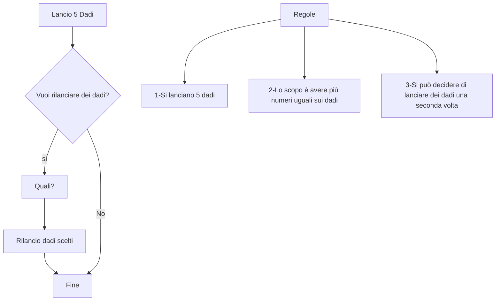

## ASSIGNMENT

Si tirano 5 dadi 

Lo scopo è avere più facce possibili con indicato lo stesso numero

> ad esempio se ho cinque su 2 dadi posso ritirare gli altri 3 dadi un'altra volta

Si può decidere di rilanciare i dadi per cui vogliamo tentare un numero diverso

 Schema 

