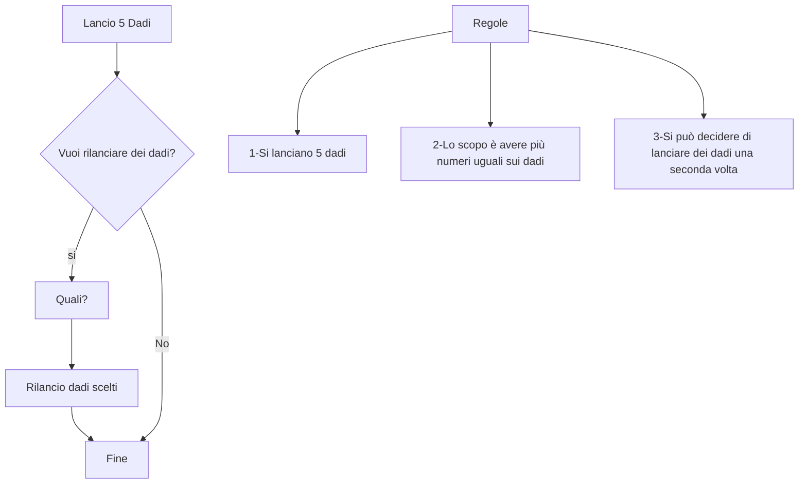

## YAHTZEE SEMPLIFICATO

Console app che :

- Chiede all'utente di tirare 5 dadi e visualizza il lancio
- Chiede all'utente quali dadi vuole cambiare
- Chiede all'utente di tirare i dadi selezionati
- A seconda del numero di dadi uguali il programma assegna un punteggio
> Ad esempio se i dadi uguali sono 2 il punteggio assegnato è uno, se sono 3 viene assegnato 2 e così via

**Obiettivo**

- Ottenere il numero maggiori di dadi uguali

**Prerequisiti**

- [x] Creare array per contenere i 5 dadi
- [x] Creare un oggetto random con un intervallo tra 1 e 6
- [x] Utilizzare un metodo per visualizzare il primo lancio
- [X] Scegliere la logica migliore per permettere all'utente di selezionare quali dadi cambiare e quali tenere
- [X] Utilizzare un metodo per visualizzare un secondo lancio
- [ ] Creare la logica di assegnazione del punteggio
- [ ] Utilizzare un metodo per visualizzare il punteggio

**Codice** 

 Schema 

