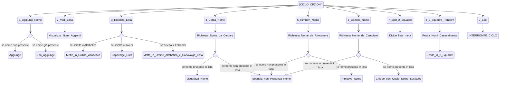

```mermaid

stateDiagram-v2
[CICLO_OPZIONI] --> 1_Aggiungi_Nome
state if_state <<choice>>
1_Aggiungi_Nome --> if_state
if_state --> Aggiunge: se nome non presente
if_state --> Non_Aggiunge : se nome già presente
[CICLO_OPZIONI] --> 2_Vedi_Lista
2_Vedi_Lista --> Visualizza_Nomi_Aggiunti
[CICLO_OPZIONI] --> 3_Riordina_Lista
state if_state2 <<choice>>
3_Riordina_Lista --> if_state2
if_state2 --> Mette_in_Ordine_Alfabetico : se scielta = Alfabetico
if_state2 --> Capovolge_Lista : se scielta = Inverti
if_state2 --> Mette_in_Ordine_Alfabetico_e_Capovolge_Lista : se scielta = Entrambi
[CICLO_OPZIONI] --> 4_Cerca_Nome
4_Cerca_Nome --> Richiesta_Nome_da_Cercare
state if_state3 <<choice>>
Richiesta_Nome_da_Cercare --> if_state3
if_state3 --> Visualizza_Nome : se nome presente in lista
if_state3 --> Segnala_non_Presenza_Nome : se nome non presente in lista
[CICLO_OPZIONI] --> 5_Rimuovi_Nome
5_Rimuovi_Nome --> Richiesta_Nome_da_Rimuovere
state if_state4 <<choice>>
Richiesta_Nome_da_Rimuovere --> if_state4
if_state4 --> Rimuove_Nome : se nome presente in lista
if_state4 --> Segnala_non_Presenza_Nome : se nome non presente in lista
[CICLO_OPZIONI] --> 6_Cambia_Nome
6_Cambia_Nome --> Richiesta_Nome_da_Cambiare
state if_state5 <<choice>>
Richiesta_Nome_da_Cambiare --> if_state5
if_state5 --> Chiede_con_Quale_Nome_Sostituire : se nome presente in lista
if_state5 --> Segnala_non_Presenza_Nome : se nome non presente in lista
[CICLO_OPZIONI] --> 7_Split_2_Squadre
7_Split_2_Squadre --> Divide_lista_metà
[CICLO_OPZIONI] --> 8_2_Squadre_Random
8_2_Squadre_Random --> Pesca_Nomi_Casuealmente
Pesca_Nomi_Casuealmente --> Divide_in_2_Squadre
[CICLO_OPZIONI] --> 9_Esci
9_Esci --> INTERROMPE_CICLO

```
    

