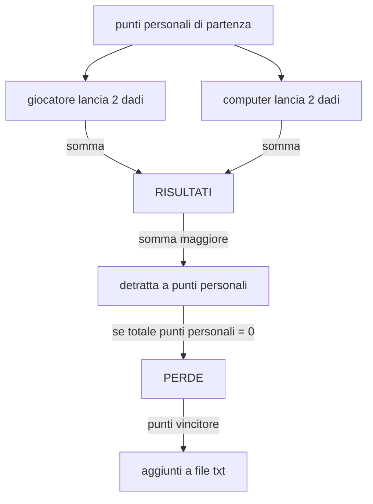

# ASSIGNMENT

Trasformare un' esercitazione precedente a scelta

Aggiungere la persistenza dei dati

Formattare con Spectre.Console

- [X] aggiungere file txt
- [X] scrivere su file txt vuoto
- [X] aggiungere il punteggio di chi vince a ogni partita nella linea giusta

## Modo alternativo di ReadAllLines(path)

```C#
// leggi punteggi da file
if (File.Exists("punteggi.txt"))
{
    using (var sr = new StreamReader("punteggi.txt"))
    {
        while (!sr.EndOfStream)
        {
            var line = sr.ReadLine();                       // 10,Paolo
            var values = line.Split(',');                   // ["10", "Paolo"]
            var punteggio = int.Parse(values[0]);           // 10
            var nome = values[1];                           // Paolo
            punteggi.Add(punteggio, nome);
        }
    }
}
```

<details>
<summary> Esercizio scelto </summary>

```C#
int playerPoints = 100;

int computerPoints = 100;

            // We generate a random object

Random random = new Random();

            // We create a cicle in which the game continues until someone gets to 0 points or less

while (playerPoints > 0 && computerPoints > 0)
{
            // We create the int sum for the player
                
    int playerSum = 0;      

    Console.WriteLine("The 2 dice show the numbers:");

            // We extabilish how many random numbers will be generated fo the player
    for (int chances = 0; chances <2; chances++ )
    {   
            // We extabilish the range of numbers
        int playerNumber = random.Next(1,7);
        Console.WriteLine(playerNumber);

            // We add the 2 numbers to the sum

        playerSum += playerNumber;      
    }
    Console.WriteLine($"The sum for the player turn is {playerSum}");

            // We create a int sum for the computer

    int computerSum = 0;

    Console.WriteLine("The 2 dice show the numbers:");

    for (int chances = 0; chances <2; chances++ )
    {   
        int computerNumber = random.Next(1,7);
        Console.WriteLine(computerNumber);

            // We add the 2 new numbers to the new sum

        computerSum += computerNumber;
    }
    Console.WriteLine($"The sum for the computer turn is {computerSum}");

            // We extabilish that who has higher number wins

    int subVersion1 = computerSum - playerSum; 

    int subVersion2 = playerSum - computerSum;

    if (computerSum > playerSum)
    {
        Console.WriteLine($"You have lost this round {subVersion1} points will be detracted from your total");

        playerPoints -= subVersion1;

            // The points get detracted from the player

        Console.WriteLine($"Your points now are : {playerPoints}");
    }
    else if (computerSum < playerSum)
    {
        Console.WriteLine($"You have won this round {subVersion2} points will be detracted from the computer total");

        computerPoints -= subVersion2;

            // The points get detracted from the computer

        Console.WriteLine($"The computer points now are : {computerPoints}");
    }
    else
    {
        Console.WriteLine("This match is even");
    }
    
    Console.WriteLine("This round is over press any key to continue:");

    Console.ReadKey();
}
```

</details>

<details>
<summary> schema </summary>


</details>
