Implementare esercitazione 42 con:

- aggiunta persistenza
- cambio menu con selezione menu prompt di Spectre.Console

- [X] cambiare i comandi console in ansiconsole
- [X] cambiare menu e inserire tutte le scelte in un prompt
- [X] nell'opzione aggiunta nomi salvare gli inserimenti in un file txt
- [ ] aggiungere colori alle scritte

<details>

<summary>ESERCIZIO DI PARTENZA</summary>

```C#
// Creation of an empty list, value "name" and "choice"

List<string> addedNames = new List<string> ();
string name;
int choice;
string rearrange;
string search;


            // The app lets us picking up options until we choose to exit

do
{           
    Console.WriteLine("Choose an option between the following:");

    Console.WriteLine("1. Add name");
    Console.WriteLine("2. See added names");
    Console.WriteLine("3. Rearrange your list");
    Console.WriteLine("4. Search a name of your choice inside the list");
    Console.WriteLine("5. Remove name");
    Console.WriteLine("6. Overwrite a name");
    Console.WriteLine("7. Create 2 squads in split mode");
    Console.WriteLine("8. Create 2 squads in random mode");
    Console.WriteLine("9. Exit");

    choice = int.Parse(Console.ReadLine()!);

    switch (choice) 
    {
        case 1:         // To add a name to our list
            Console.Write("Insert here the name you want to add\t");
            name = Console.ReadLine()!.Trim();

            if(addedNames.Contains(name))
            {
                Console.WriteLine($"Impossibility to add : {name} is already in the list!!");
            }
            else
            {
                addedNames.Add(name);
            }
            break;                                         
        case 2:         // To see our list
            Console.WriteLine($"The current participants are:{addedNames.Count}\n The complete list is:");

            foreach (string added in addedNames)
            {
            Console.WriteLine(added);
            }
            break;
        case 3:         // To rearrange our list
            Console.WriteLine("Do you prefer rearrange the list in alphabetical or reversed order, or both (A/R/B) ?");

            rearrange = Console.ReadLine()!.Trim();

            if (rearrange == "A" )
            {
                addedNames.Sort();
            }
            else if (rearrange == "R")
            {
                addedNames.Reverse();
            }
            else if (rearrange == "B")
            {
                addedNames.Sort();
                addedNames.Reverse();
            }
            else
            {
                Console.WriteLine("The current option is not valid");
            }
            break;
        case 4:
            Console.WriteLine("What name do you want to search?");

            search = Console.ReadLine()!;
            if (addedNames.Contains(search))
            {
                Console.WriteLine($"{search} is in the list");
            }
            else
            {
                Console.WriteLine($"{search} is not in the list");
            }
            break;
        case 5:
            Console.WriteLine("What name do you want to remove?");
            
            name = Console.ReadLine()!.Trim();

            if(addedNames.Contains(name))
            {
                addedNames.Remove(name);
                Console.WriteLine($"{name}'s name has been succesfully removed!");
            }
            else
            {
                Console.WriteLine($"{name}'s name doesn't appear in this list, therefore it can't be removed");
            }
            break;
        case 6:
            Console.WriteLine("Which name do you want to overwrite");
            name = Console.ReadLine()!;
            if (addedNames.Contains(name))
            {
                Console.Write("Enter the new name:\t");
                string newName = Console.ReadLine()!;
                int index = addedNames.IndexOf(name);
                addedNames[index] = newName;
                Console.WriteLine("The edit occured successfully!");
            }
            else
            {
                Console.WriteLine($"{name} doesn't appear in this list");
            }
            break;
        case 7: 
            int split = addedNames.Count/2;
            List<string> squad1 = addedNames.GetRange(0, split);
            List<string> squad2 = addedNames.GetRange(split, addedNames.Count-split);
            Console.WriteLine("Squad 1:");
            foreach (string partecipant in squad1)
            {
                Console.WriteLine(partecipant);
            }
            Console.WriteLine("Squad 2:");
            foreach (string partecipant in squad2)
            {
                Console.WriteLine(partecipant);
            }
            break;


        case 8:

            List<string> squad1Random = new List<string> ();
            List<string> squad2Random = new List<string> ();
            Random random = new Random();

            // The app separates the participants in 2 squads
        while(addedNames.Count > 0)
        {
            int index = random.Next(addedNames.Count);
            string participant = addedNames[index];
            addedNames.RemoveAt(index);
            if(squad1Random.Count < squad2Random.Count)
            {
                squad1Random.Add(participant);
            }
            else
            {
                squad2Random.Add(participant);
            }
        }
        Console.WriteLine("participants in squad 1 are:");
        foreach (string participant in squad1Random)
        {
            Console.WriteLine(participant);
        }
        Console.WriteLine("participants in squad 2 are:");
        foreach (string participant in squad2Random)
        {
            Console.WriteLine(participant);
        }
        addedNames.Clear();
        break;

        case 9:         // To stop the cicle
            Console.WriteLine("This session will be closed :)");
            break;
        default:
        Console.WriteLine("The current option is not valid");
        break;
    }
}
while (choice != 9);
```

```mermaid
stateDiagram-v2
[CICLO_OPZIONI] --> 1_Aggiungi_Nome
state if_state <<choice>>
1_Aggiungi_Nome --> if_state
if_state --> Aggiunge: se nome non presente
Aggiunge --> file.txt
if_state --> Non_Aggiunge : se nome già presente
[CICLO_OPZIONI] --> 2_Vedi_Lista
2_Vedi_Lista --> Visualizza_Nomi_Aggiunti
[CICLO_OPZIONI] --> 3_Riordina_Lista
state if_state2 <<choice>>
3_Riordina_Lista --> if_state2
if_state2 --> Mette_in_Ordine_Alfabetico : se scielta = Alfabetico
if_state2 --> Capovolge_Lista : se scielta = Inverti
if_state2 --> Mette_in_Ordine_Alfabetico_e_Capovolge_Lista : se scielta = Entrambi
[CICLO_OPZIONI] --> 4_Cerca_Nome
4_Cerca_Nome --> Richiesta_Nome_da_Cercare
state if_state3 <<choice>>
Richiesta_Nome_da_Cercare --> if_state3
if_state3 --> Visualizza_Nome : se nome presente in lista
if_state3 --> Segnala_non_Presenza_Nome : se nome non presente in lista
[CICLO_OPZIONI] --> 5_Rimuovi_Nome
5_Rimuovi_Nome --> Richiesta_Nome_da_Rimuovere
state if_state4 <<choice>>
Richiesta_Nome_da_Rimuovere --> if_state4
if_state4 --> Rimuove_Nome : se nome presente in lista
if_state4 --> Segnala_non_Presenza_Nome : se nome non presente in lista
[CICLO_OPZIONI] --> 6_Cambia_Nome
6_Cambia_Nome --> Richiesta_Nome_da_Cambiare
state if_state5 <<choice>>
Richiesta_Nome_da_Cambiare --> if_state5
if_state5 --> Chiede_con_Quale_Nome_Sostituire : se nome presente in lista
if_state5 --> Segnala_non_Presenza_Nome : se nome non presente in lista
[CICLO_OPZIONI] --> 7_Split_2_Squadre
7_Split_2_Squadre --> Divide_lista_metà
[CICLO_OPZIONI] --> 8_2_Squadre_Random
8_2_Squadre_Random --> Pesca_Nomi_Casuealmente
Pesca_Nomi_Casuealmente --> Divide_in_2_Squadre
[CICLO_OPZIONI] --> 9_Esci
9_Esci --> INTERROMPE_CICLO
```

</details>

<details>

<summary>SCHEMA</summary>



</details>