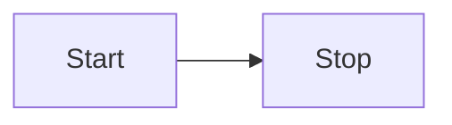
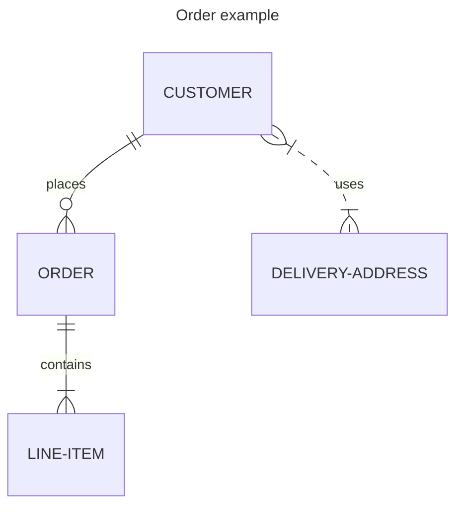

# Titolo orincipale
## Sottotitolo 1
### Titolo paragrafo

> esempio di quote (citazione)

esempio di __grassetto__ o **bold**

esempio di _italic_

- primo
    - sottoelenco
- secondo
    - sottoelenco
- terzo
- quarto
- quinto

## esempio di check
- [ ] uno
- [x] due

backtick

` (alt 96)

```
git status
git add
git commit
```

```C#
class program
{
    static void Main(string[] args)
    {
        Console.Writeline("Hello World!");
    }
}
```

```html
<div>
<p>testo</p>
</div>
```

```css
div.split
{height: 1.2em, background-color: #CCC}
div.split
h3{margin:0;font-size:120%}
```

[Link a paina 2](02_link.md)

<!-- Commento che non appare nel render markdown -->

| Syntax | Description |
| ------------|-------------|
| Header | Title |
| Paragraph | ![esempio di SVG di svg repo]|
| Header | Title |
| Paragraph | ![esempio di SVG di svg repo]|

<details>

<summary>Tips for collapsed sections</summary>

### You can add a header

You can add text within a collapsed section.

You can add an image or a code block, too.

```ruby
    puts "Hello World"
```

</details>





```mermaid
---
title: Example Git diagram
---
gitGraph
   commit
   commit
   branch develop
   checkout develop
   commit
   commit
   checkout main
   merge develop
   commit
   commit
   ```