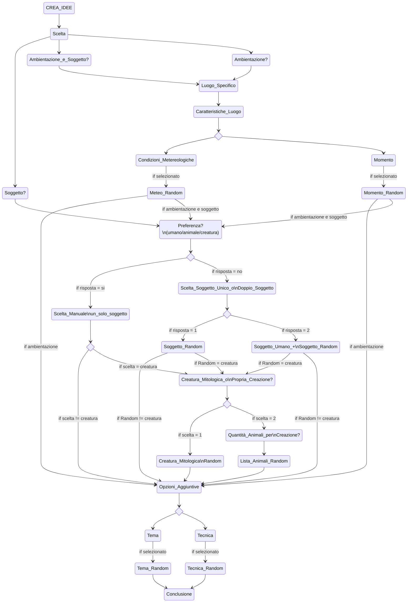
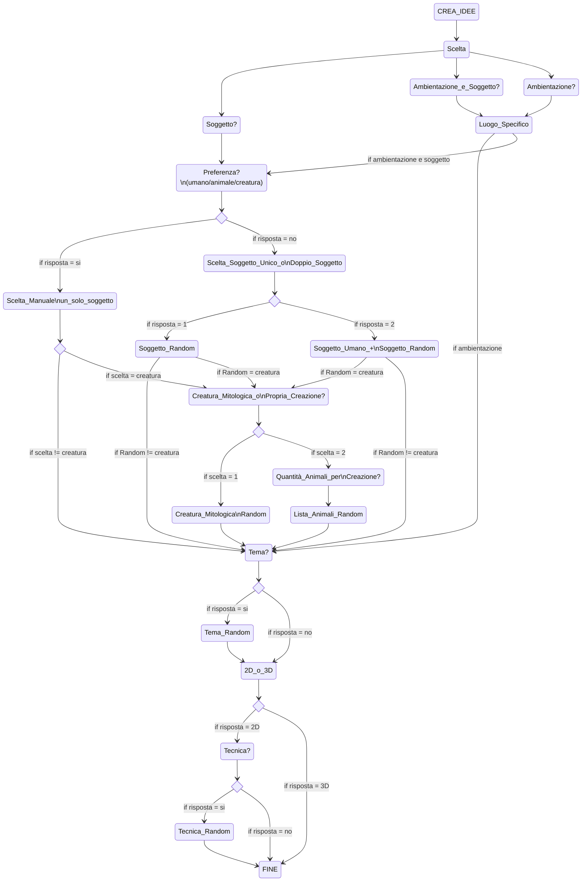

## IDEA
- Creare un'app che dia consigli su cosa progettare sia in 2d che 3d ed eventualmente dica quali oggetti/soggetti prendere come reference

<details>
<summary>Definizioni utili per la progettazione</summary>

- Quali elementi possono essere creati:
1. Ambienti
2. Oggetti
3. Soggetti

- I soggetti possono essere:
1. Persone
2. Creature
3. Animali

- In quali contesti possono essere rappresentati:
1. Fantasy
2. Horror
3. Steampank
4. Adventure
5. Sci-fi

- I disegni 2D possono essere realizzati con le seguenti tecniche:

1. Matita
2. Carboncino
3. Acquarelli
4. Tempere
5. Colori ad olio
6. Gessetti


</details>

## Target

Chiunque voglia disegnare o creare un progetto 3D ma non ha una consegna precisa o non ha delle idee da cui partire

# Funzionalità

- L'app chiede all'utente se vuole creare un'ambientazione, un soggetto o entrambi.
- Per la sola AMBIENTAZIONE sceglierà, in maniera RANDOM e da un FILE ESTERNO, un luogo specifico.
- Per il SOGGETTO chiederà all'utente se ha delle PREFERENZE (umano, animale, creatura).
- Se l'utente non ha preferenze, il computer chiederà se l'utente desidera UN SOLO soggetto o UNA COPPIA di soggetti (umano, animale/creatura)
- L'app chiede se l'utente necessita di un TEMA di riferimento
- L'app chiede se il progetto sarà in 2D o 3D
- Per il 2D l'app chiede se l'tente necessita di una TECNICA di esecuzione
- L'app in coclusione suggerisce qualche sito dove poter pubblicare il proprio lavoro

# Passaggi

- [X] Creare un file Json contenente le ambientazioni
- [X] Creare un file Json contenente vari animali
- [X] Creare un file Json contenente creature mitologiche
- [X] Creare un file Json contenente vari temi
- [X] Creare un file Json contenente le possibili tecniche
- [X] Scrivere il menu principale di scelta
- [X] Aggiungere il sottomenu dell'ambientazione
- [X] - estrarre il luogo dal file Json
- [X] Aggiungere il sottomenu del soggetto
- [X] - sottomenu scelta autonoma
- [X] - - estrazione soggetto da un file Json
- [X] - scelta uno o due soggetti
- [X] - - estrazione da file Json
- [X] Scelta tema
- [X] Input 2D o 3D
- [X] Tecnica di disegno 2D
- [X] Chiusura del programma
- [X] Gestione delle eccezioni
- [ ] Inserire più elementi nei vari file json
- [ ] Inserire una lista esaustiva nel file animali
- [X] Prova debugging





</details>


<details>
<summary> Guida alla lettura del codice </summary>

 - Prima il commento , poi il codice a cui si riferisce
   - // scritti 3 tabs più a destra rispetto all'inizio del codice
     - 1 spazio tra // e il commento
 - Occasionalmente i commenti corti saranno scritti nella stessa linea di codice
   - // 1 tab più a destra della fine della linea di codice
 - Nomi variabili in camelCase
 - Nomi Metodi in PascalCase
 - 5 file json
 - Variabili e costanti vengono dichiarate all'inizio del blocco di codice (inteso come Main o specifico Metodo) con una cornice
 - I Metodi sono raggruppati tramite un commento scritto tutto maiuscolo e a inizio riga
   - Ogni metodo è separato da //---------------------------------
</details>

<details>
<summary> Codice con C# senza implementazioni </summary>

```C#
// Pacchetto esterno per poter usare i file JSON
using Newtonsoft.Json;
class Program  
{
    static void Main()
    {
        string scelta; // Variabili usate nel Main
    //-----------------//

                    // Puliamo la console
        Console.Clear();

                    // Titolo
        Console.WriteLine("IDEE PER ILLUSTRAZIONI\n");

        Avvertimenti();
        Proseguimento();
    
        MenuPrincipale();   // Metodo per visualizzare il primo menu di scelta

        Console.WriteLine("Vuoi un tema di riferimento? (s/n)");
        
        scelta = Console.ReadLine()!.ToLower().Trim();

        if (scelta == "s")
        {
            CaricaTema();   // Metodo per ottenere un tema
            Proseguimento();
        }
        else if (scelta == "n") Proseguimento();
        else Errore();

        Console.WriteLine("Il disegno è 2D (su carta) o 3D? Se su carta vuoi una tecnica di riferimento? (s/n)");

        scelta = Console.ReadLine()!.ToLower().Trim();

        if (scelta == "s")
        {
            CaricaTecnica(); 
            Proseguimento();
        }
        else if (scelta == "n") Proseguimento();
        else Errore();

        Conclusione();  // Metodo per chiudere il programma 
    }

// METODI PER LA FLUIDITÀ DEL CODICE---------------------------------------------------------------------------------------------

    static void Avvertimenti()
    {
        Console.WriteLine("REGOLE ED AVVERTIMENTI");
        Console.WriteLine("1.I nomi di animali, creature e temi saranno scritti in inglese per convenzione");
        Console.WriteLine("2.Se si fa un inserimento sbagliato l'opzione darà errore o/e verrà saltata");
    }
//----------------------------------------------------------------------------------------------------------------------------------
    static void Proseguimento()
    {
                    // Per permettere all'utente di proseguire al premere di untasto e cancellare a schermo le linee precedenti
        Console.WriteLine("\nPremere un tasto per proseguire...");
        Console.ReadKey();

        Console.Clear();
    }
//--------------------------------------------------------------------------------------------------------------------------------------
    static void Conclusione()
    {               
                    // Frasi di chiusura
        Console.WriteLine("Ora dovresti avere tutto l'occorrente per iniziare il tuo progetto");
        Console.WriteLine("Di seguito alcuni siti/app dove poter pubblicare le tue opere");
    }
//-------------------------------------------------------------------------------------------------------------------------------
    static void Errore()
    {
        Console.WriteLine("Opzione non valida");   // in caso di inserimento non previsto
    }

// METODI PER MENU E SOTTOMENU-------------------------------------------------------------------------------------------------------

    static void MenuPrincipale()
    {
        int scelta; //
    //--------------//

                    // Tre opzioni
        Console.WriteLine("Scegliere l'area principale di proprio interesse! (1/2/3)");
        Console.WriteLine("1.Ambiente");
        Console.WriteLine("2.Soggetto");
        Console.WriteLine("3.Ambiente e Soggetto");

        try
        {
            scelta = Convert.ToInt32(Console.ReadLine());

            switch (scelta)
            {
                case 1:
                    Console.Clear();
                    CaricaLuogo();  // Metodo per ottenere un luogo
                    Proseguimento();    // Metodo per pulire la console
                    break;

                case 2:
                    Console.Clear();
                    PreferenzaSoggetto();   // Metodo per scegliere il/i soggetto/i
                    break;

                case 3:
                    Console.Clear();
                    CaricaLuogo();
                    Proseguimento();
                    PreferenzaSoggetto();
                    break;

                default:
                    Errore();   // Metodo per segnalare una scelta inaspettata dal programma
                    Proseguimento();
                    MenuPrincipale();
                    break;
            }
        }
        catch (Exception ex)
        {
            Console.WriteLine("Si richiede l'inserimento di un numero");
            Console.WriteLine($"ERRORE NON TRATTATO: {ex.Message}");
            Proseguimento();
            MenuPrincipale();
        }
    }
//-----------------------------------------------------------------------------------------------------------------------------------
    static void PreferenzaSoggetto()
    {
        int scelta; //
    //--------------//

                    // Menu per la preferenza di soggetto
        Console.WriteLine("Scegliere tra le seguenti opzioni (1/2/3/4)");
        Console.WriteLine("1.Umano");
        Console.WriteLine("2.Animale");
        Console.WriteLine("3.Creatura");
        Console.WriteLine("4.Nessuna preferenza");

        try
        {
            scelta = Convert.ToInt32(Console.ReadLine()!.Trim());

            switch (scelta)
            {
                case 1:
                                // Se viene scelto umano non ci sono specifiche da consigliare
                    Proseguimento();
                    break;

                case 2:
                    Console.Clear();
                    CaricaAnimale();
                    Proseguimento();
                    break;

                case 3:
                    Console.Clear();
                    TipoCreatura();
                    break;

                case 4:
                    Proseguimento();
                    QuantitativoSoggetti();
                    break;

                default:
                    Errore();
                    Proseguimento();
                    PreferenzaSoggetto();
                    break;
            }
        }
        catch(Exception ex)
        {
            Console.WriteLine("Si richiede l'inserimento di un numero");
            Console.WriteLine($"ERRORE NON TRATTATO: {ex.Message}");
            Proseguimento();
            PreferenzaSoggetto();
        }
    }

// METODI PER SCELTE SPECIFICHE---------------------------------------------------------------------------------------------

    static void TipoCreatura()
    {
        string sceltaCreatura; //
    //-------------------------//

                    // Scelta tra una creatura mitologica e una propria creazione
        Console.WriteLine("Preferisci una creatura mitologica o inventarne una te? (m/i)");

        try
        {
            sceltaCreatura = Console.ReadLine()!.ToLower().Trim();

            if (sceltaCreatura == "m")  // restituiamo una creatura random
            {
                Console.Clear();
                            // Metodo per ottenere una creatura mitologica e Metodo per pulire la console
                CaricaCreaturaMitologica();
                Proseguimento();
            }
            else if (sceltaCreatura == "i") // restituiamo una lista di animali
            {
                Console.Clear();
                CaricaAnimali();
                Proseguimento();
            }
            else 
            {
                Errore();
                Proseguimento();
                TipoCreatura();
            }
        }
        catch (Exception ex)
        {
                        // Non preciso un messaggio perchè non sono a conoscenza di tipi di eccezioni per questa casistica
            Console.WriteLine($"ERRORE NON TRATTATO: {ex.Message}");
            Proseguimento();
            TipoCreatura();
        }
    }
//--------------------------------------------------------------------------------------------------------------------------------
    static void QuantitativoSoggetti()
    {
        string quantitativoSoggetti; //
    //-------------------------------//

        Console.WriteLine("Preferisci un soggetto unico o una coppia di soggetti? (u/c)");

                    // scelta quantità soggetti e relative casistiche 
        quantitativoSoggetti = Console.ReadLine()!.ToLower().Trim();

        if (quantitativoSoggetti == "u") SoggettoCasuale();
        
        else if (quantitativoSoggetti == "c")
        {
            Console.WriteLine("Il primo soggetto sarà umano il secondo sarà sorteggiato casualmente");

            Proseguimento();

            SoggettoCasuale();
        }
        else 
        {
            Errore();
            Proseguimento();
            QuantitativoSoggetti();
        }
    }

// METODI PER SCELTE RANDOM ------------------------------------------------------------------------------------------------------------------------------------
    static void SoggettoCasuale()
    {
        Random random = new Random(); //
        int soggettoRandom;           //
    //--------------------------------//

        soggettoRandom = random.Next(1, 4);

        switch(soggettoRandom)
        {
            case 1:
                Console.WriteLine("Il soggetto sarà umano");
                Proseguimento();
                break;

            case 2:
                CaricaAnimale();
                Proseguimento();
                break;

            case 3:
                TipoCreatura();
                Proseguimento();
                break;

            default:
                Errore();
                break;
        }
    }

// METODI CHE ESTRAPOLANO DEGLI OGGETTI DA SPECIFICI FILE JSON----------------------------------------------------------------------

    static void CaricaLuogo()
    {
        Random random = new Random(); //
        int indice;                   //
    //--------------------------------//

        try
        {
                        // Crezione un percorso tra il programma e il file dei luoghi
            string path = @"luoghi.json";
                        // Lettura dell'intero file tramite il percorso
            string json = File.ReadAllText(path);
                        // Deserializziamo il file json e lo assegnamo a un oggetto dinamico
            dynamic obj = JsonConvert.DeserializeObject(json)!;

                        // Generiamo un numero random compreso tra 0 (inizio del file) e la conta totale degli oggetti presenti nel file
            indice = random.Next(0,obj.Count);

                        // Scriviamo in console il luogo selezionato tramite indice, che corrisponde al numero random generato in precedenza
            Console.WriteLine("Il tuo luogo di riferimento sarà:");
            Console.WriteLine(obj[indice].luogo);
        }
        catch (Exception ex)
        {
            Console.WriteLine("Il file non esiste");
            Console.WriteLine($"{ex.Message} \n {ex.HResult} \n {ex.Data}");
            return;
        }
    }
//-------------------------------------------------------------------------------------------------------------------------------------
    static void CaricaAnimale()
    {   
        Random random = new Random(); //
        int indice;                   //
    //--------------------------------//

        try
        {
                        // Colleghiamo il file degli animali come abbiamo fatto per quello dei luoghi
            string path = @"animali.json";
            string json = File.ReadAllText(path);
            dynamic obj = JsonConvert.DeserializeObject(json)!;

                        // Il programma stampa un oggetto del file tramite indice scelto in maniera random
            indice = random.Next(0, obj.Count);

            Console.WriteLine("L'animale sarà:");
            Console.WriteLine(obj[indice].animale);
        }
        catch (Exception ex)
        {
            Console.WriteLine("Il file non esiste");
            Console.WriteLine($"{ex.Message} \n {ex.HResult} \n {ex.Data}");
            return;
        }
    }
//------------------------------------------------------------------------------------------------------------------------------------
    static void CaricaAnimali()
    {
        Random random = new Random();//
        int indice;                  //
        int quantitativoAnimali;     //
    //-------------------------------//

        Console.WriteLine("quanti animali vuoi usare per comporre la tua creatura?(2-5)");

                    // Scelta numero animali
        quantitativoAnimali = Convert.ToInt32(Console.ReadLine()!.Trim());

        Console.Clear();

        try
        {
                        // Colleghiamo il file degli animali come abbiamo fatto per quello dei luoghi
            string path = @"animali.json";
            string json = File.ReadAllText(path);
            dynamic obj = JsonConvert.DeserializeObject(json)!;

            Console.WriteLine("Gli animali saranno:");

                        // Ciclo per continuare a pescare un animale random per il quantitativo di volte scelto dall'utente
            for (int i = 1; i <= quantitativoAnimali ;i++ ) 
            {
                            // Il programma stampa un oggetto del file tramite indice scelto in maniera random
                indice = random.Next(0, obj.Count);
                Console.WriteLine(obj[indice].animale);
            }
        }
        catch (Exception ex)
        {
            Console.WriteLine("Il file non esiste");
            Console.WriteLine($"{ex.Message} \n {ex.HResult} \n {ex.Data}");
            return;
        }
    }
//------------------------------------------------------------------------------------------------------------------------------------
    static void CaricaCreaturaMitologica()
    {
        Random random = new Random(); //
        int indice;                   //
    //--------------------------------//

        try
        {
                        // Colleghiamo il file delle creature mitologiche 
            string path = @"creature.json";
            string json = File.ReadAllText(path);
            dynamic obj = JsonConvert.DeserializeObject(json)!;

                        // Il programma stampa un oggetto del file tramite indice scelto in maniera random
            indice = random.Next(0, obj.Count);

            Console.WriteLine("La creatura sarà:");
            Console.WriteLine(obj[indice].creatura);
        }
        catch (Exception ex)
        {
            Console.WriteLine("Il file non esiste");
            Console.WriteLine($"{ex.Message} \n {ex.HResult} \n {ex.Data}");
            return;
        }
    }
//------------------------------------------------------------------------------------------------------------------------------------
    static void CaricaTema()
    {
        Random random = new Random(); //
        int indice;                   //
    //--------------------------------//

        try
        {
                        // Collegamento a file dei temi
            string path = @"temi.json";
            string json = File.ReadAllText(path);
            dynamic obj = JsonConvert.DeserializeObject(json)!;

                        // Stampa di un oggetto del file tramite indice
            indice = random.Next(0, obj.Count);

            Console.WriteLine("Il tema sarà:");
            Console.WriteLine(obj[indice].tema);
        }
        catch (Exception ex)
        {
            Console.WriteLine("Il file non esiste");
            Console.WriteLine($"{ex.Message} \n {ex.HResult} \n {ex.Data}");
            return;
        }
    }
//------------------------------------------------------------------------------------------------------------------------------------
    static void CaricaTecnica()
    {
        Random random = new Random(); //
        int indice;                   //
    //--------------------------------//

        try
        {
                        // Collegamento a file delle tecniche
            string path = @"tecniche.json";
            string json = File.ReadAllText(path);
            dynamic obj = JsonConvert.DeserializeObject(json)!;

                        // Stampa di un oggetto del file tramite indice
            indice = random.Next(0, obj.Count);

            Console.WriteLine("La tecnica sarà:");
            Console.WriteLine(obj[indice].tecnica);
        }
        catch (Exception ex)
        {
            Console.WriteLine("Il file non esiste");
            Console.WriteLine($"{ex.Message} \n {ex.HResult} \n {ex.Data}");
            return;
        }
    }
}
```
</details>

<details>
<summary> Schema originale </summary>



</details>

<details>
<summary> Implementazioni </summary>

- [X] Visione grafica con Spectre.Console
- [ ] Front End con Html e Css
- [ ] Stampa tabella finale con tutte le scelte
- [ ] Restart del ciclo a fine programma per più progetti
- [ ] Aggiunta opzioni come caratteristiche e personalità dei personaggi, materiali degli oggetti
- [ ] Aggiunta caratteristiche dei luoghi (es meteo, orario);
- [ ] Migliorare il codice con più Metodi, in modo che le variabili inserite in essi siano richiamabili anche all'interno del Main (se possibile)
- [ ] Creare versione in inglese
- [ ] Link a siti esterni
- [ ] visualizzazione foto di esempio

</details>

<details>
<summary> Problemi riscontrati </summary>

-   <details>
    <summary> Risolti </summary>

    In Metodo CaricaAnimali il for non restituisce nulla

    ```C#
    for (int i = 1; i == quantitativoAnimali ;i++ ) 

    // soluzione    <= invece di ==
    ```

    Impossibilità di usare ReadKey invece di ReadLine per assegnare un char a una stringa

    ```C#
    string scelta; 
    scelta = Console.ReadKey();

    // soluzione    scelta = Console.ReadKey(true).KeyChar.ToString();       (true serve a non mostrare il carattere scritto dall'utente)
    ```

    Conversione da ReadKey a intero non gestisce nessun inserimento anche se giusto

    ```C#
    int quantitativoAnimali;
    quantitativoAnimali = int.Parse(Console.ReadKey(true).KeyChar);

    // soluzione quantitativoAnimali = int.Parse(Console.ReadKey(true).KeyChar.ToString());
    ```


    </details>

-   <details>
    <summary> Non risolti </summary>

    </details>


</details>