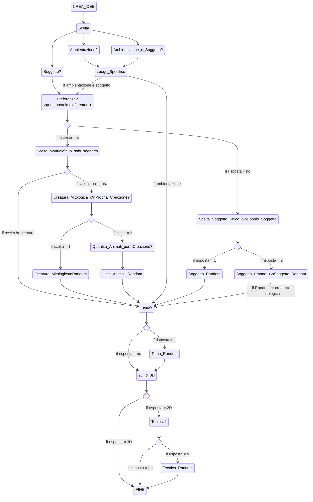

## IDEA
- Creare un'app che dia consigli su cosa progettare sia in 2d che 3d ed eventualmente dica quali oggetti/soggetti prendere come reference

Definizioni utili per la progettazione

- Quali elementi possono essere creati:
1. Ambienti
2. Oggetti
3. Soggetti

- I soggetti possono essere:
1. Persone
2. Creature
3. Animali

- In quali contesti possono essere rappresentati:
1. Fantasy
2. Horror
3. Steampank
4. Adventure
5. Sci-fi

- I disegni 2D possono essere realizzati con le seguenti tecniche:

1. Matita
2. Carboncino
3. Acquarelli
4. Tempere
5. Colori ad olio
6. Gessetti

## Target

Chiunque voglia disegnare o creare un progetto 3D ma non ha una consegna precisa e non delle idee da cui partire

# Funzionalità

- L'app chiede all'utente se vuole creare un'ambientazione, un soggetto o entrambi.
- Per la sola AMBIENTAZIONE sceglierà, in maniera RANDOM e da un FILE ESTERNO, un luogo specifico.
- Per il SOGGETTO chiederà all'utente se ha delle PREFERENZE (umano, animale, creatura).
- Se l'utente non ha preferenze, il computer chiederà se l'utente desidera UN SOLO soggetto o UNA COPPIA di soggetti (umano, animale/creatura)
- L'app chiede se l'utente necessita di un TEMA di riferimento
- L'app chiede se il progetto sarà in 2D o 3D
- Per il 2D l'app chiede se l'tente necessita di una TECNICA di esecuzione
- L'app in coclusione suggerisce qualche sito dove poter pubblicare il proprio lavoro

# Passaggi

- [ ] Creare un file Json contenente le ambientazioni
- [ ] Creare un file Json contenente vari animali
- [ ] Creare un file Json contenente creature mitologiche
- [ ] Creare un file Json contenente vari temi
- [ ] Creare un file Json contenente le possibili tecniche
- [ ] Scrivere il menu principale di scelta
- [ ] Aggiungere il sottomenu dell'ambientazione
- [ ] - estrarre il luogo dal file Json
- [ ] Aggiungere il sottomenu del soggetto
- [ ] - sottomenu scelta autonoma
- [ ] - - estrazione soggetto da un file Json
- [ ] - scelta uno o due soggetti
- [ ] - - estrazione da file Json
- [ ] Scelta tema
- [ ] Input 2D 0 3D
- [ ] Tecnica di disegno 2D
- [ ] Chiusura del programma

 Implementazioni 

- [ ] Visione grafica con Spectre.Console
- [ ] Front End con Html e Css
- [ ] Stampa tabella finale con tutte le scelte
- [ ] Restart del ciclo a fine programma per più progetti
- [ ] Aggiunta opzioni come caratteristiche e personalità dei personaggi, materiali degli oggetti

